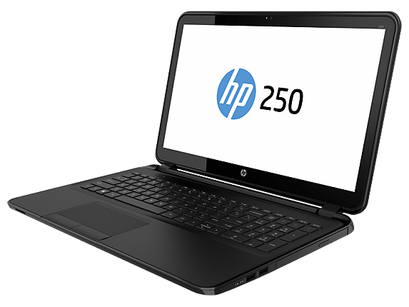
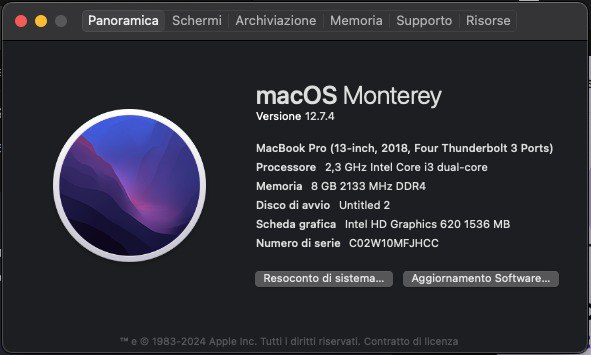

[)](https://www.paypal.com/paypalme/AlessioSavinelli211)
# HP-250-G6-Kabylake

## IMPORTANT: minimum Bios version F77
- Original ACPI have integrated Device AWAC and RTC Method _STA=Zero.

| Component        | Brank                              |
| ---------------- | ---------------------------------- |
| CPU              | Intel I3 7020U                     |
| iGPU             | Intel® HD Graphics 620             |
| Display          | 1366x768                           |
| Audio            | Realtek ALC282                     |
| Ram              | 8 Gb ddr4 2400 Mhz                 |
| Wifi + Bluetooth | AC 3168                            |
| SSD              | Kingston A400 512gb                |
| SmBios           | MacBookPro15.2                     |
| BootLoader       | OpenCore                           |

 

### What works and What doesn't or WIP:
- [x] Intel HD 620 iGPU HDMI Output
- [x] ALC282 Internal Speakers
- [x] ALC282 Native Combojack
- [x] ALC282 HDMI Audio Output
- [x] All USB Ports 
- [x] SpeedStep / Sleep / Wake
- [x] Touchpad with gesture
- [x] Brightness Key
- [x] Wi-Fi
- [x] Realtek RTL8111 LAN
- [x] Cardreader
- [x] ACPI Battery
- [x] NVRAM
- [x] Windows boot from OpenCore

### Special Config:
- Usb port mapping performed
- Disabled unused device
- Cosmetics DSM in Configplist
